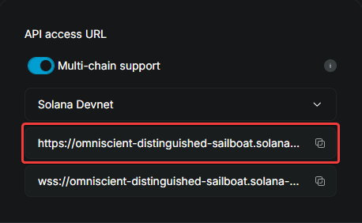

# Use Pyth price feeds in an Anchor program

Pyth is a first-party price oracle that aggregates trusted, low-latency quotes from top exchanges/market-makers and publishes onchain price feeds for a variety of asset classes, each with a price and confidence interval.

This tutorial shows you how to consume a [Pyth price](https://www.pyth.network/price-feeds) inside a Solana program written with Anchor. We use the [Pyth Solana Receiver](https://crates.io/crates/pyth-solana-receiver-sdk) *price update account* flow. In this flow, the client posts a fresh, signed price update and, in the same transaction, calls your program, which verifies and reads that update. For price feed accounts, see [Other methods](#other-methods).

- [Use Pyth price feeds in an Anchor program](#use-pyth-price-feeds-in-an-anchor-program)
  - [What you'll do](#what-youll-do)
  - [Prerequisites](#prerequisites)
    - [Get a QuickNode endpoint](#get-a-quicknode-endpoint)
    - [Version checks](#version-checks)
    - [Get your Pyth feed ID](#get-your-pyth-feed-id)
  - [1. Set up the project scaffold](#1-set-up-the-project-scaffold)
  - [2. Write the onchain program](#2-write-the-onchain-program)
    - [Code explanation](#code-explanation)
  - [3. Build and deploy to devnet](#3-build-and-deploy-to-devnet)
  - [4. Run the client (post + use)](#4-run-the-client-post--use)
  - [Troubleshooting](#troubleshooting)
  - [Other methods](#other-methods)
    - [Use a price feed account](#use-a-price-feed-account)

## What you'll do

- Set up an Anchor program on devnet that reads a Pyth price update account and logs `price/conf/exponent/timestamp`.
- Build a compile-first TypeScript client that fetches the latest price from Pyth Hermes, posts it onchain via Pyth Receiver, then calls your program in one transaction.
- Verify by inspecting transaction logs and printing a human-readable price.

## Prerequisites

>**Note**: 
>- If you're new to Solana or Anchor, review our [Solana fundamentals](https://www.quicknode.com/guides/solana-development/getting-started/solana-fundamentals-reference-guide) and [Intro to Anchor](https://www.quicknode.com/guides/solana-development/anchor/how-to-write-your-first-anchor-program-in-solana-part-1) guides.
>- We have [a tutorial](https://www.quicknode.com/guides/solana-development/3rd-party-integrations/pyth-price-feeds) for Pyth price feeds using the [Solana Playground (web-based IDE)](https://beta.solpg.io/) for a zero-install experience, but fast-moving SDK/toolchain changes can cause version mismatches. This guide uses a local Anchor workspace for reproducibility.

Before you begin, ensure you have:

- Solana CLI (Agave) v2.x
- Rust toolchain via rustup: `rustup`, `rustc`, and `cargo`
- Anchor CLI 0.31.x
- Node 18+ and npm (for the client script)
- A devnet RPC URL (e.g., a QuickNode endpoint) and a funded devnet keypair
- The Pyth feed ID (64-char hex for the asset you want, e.g., ETH/USD).
- Devnet RPC URL and a funded devnet keypair (Recommended: QuickNode)

### Get a QuickNode endpoint

In your QuickNode dashboard:

1. Go to **Endpoints** → **+ New Endpoint**.
2. Select **Blockchain: Solana** → **Network: Devnet** → **Create**.
3. Copy the HTTP provider URL.

    

### Version checks

Run these commands to ensure you're up to date:

```bash
solana --version
rustc --version
anchor --version 
cargo --version
rustup show active-toolchain
node --version 
npm --version
```
  
### Get your Pyth feed ID

1. Open [Pyth Insights: Price Feeds](https://insights.pyth.network/price-feeds).
2. Search for your asset.
3. Copy the Price Feed ID.
  
    For example, the feed ID for ETH/USD (used in this tutorial) is: `0xff61491a931112ddf1bd8147cd1b641375f79f5825126d665480874634fd0ace`

## 1. Set up the project scaffold

1. Create a new Anchor workspace (or add to an existing one), then `cd` into it:
    
    ```bash
    # Creates an Anchor workspace with TypeScript test and npm as the package manager
    anchor init pyth-demo --package-manager npm
    cd pyth-demo
    ```

2. Add dependencies to `programs/pyth-demo/Cargo.toml`:

    ```toml
    [dependencies]
    anchor-lang = "0.31.1"
    pyth-solana-receiver-sdk = "0.6.1"

    # TEMP pin: SBF toolchain can't compile base64ct ≥ 1.8 (Rust 2024).
    base64ct = "=1.7.3"   # remove once the SBF toolchain ships rustc ≥ 1.85
    ```

    Do *not* add `solana-program` manually; Anchor pins the right version for you.

3. Target devnet in `Anchor.toml`:
    
    1. If your `[provider]` block says `cluster = "localnet"`, switch it to devnet with this command:

        ```bash
        sed -i 's/^cluster = "localnet"/cluster = "devnet"/' Anchor.toml || true
        ```

    2. Point your Solana CLI at your [QuickNode devnet URL](#get-a-quicknode-endpoint):

        ```bash
        solana config set --url https://<insert-your-quicknode-devnet-url>
        ```

4. Lock toolchain and confirm PATH (prevents version mismatch errors):

    1. Update `anchor.toml`

        ```toml
        [toolchain]
        anchor_version = "0.31.1"
        solana_version = "2.3.8"   # Agave (known-good)
        package_manager = "npm"
        ```
    
    2. Verify versions:

        ```bash
        solana --version   # expect 2.3.x
        anchor --version   # expect 0.31.1
        ```

        If these match, move on to Step 5. If they don't, see [Troubleshooting → Toolchain/PATH mismatch](#troubleshooting).

5. Set your program ID:

    A program ID is your program's onchain address (pubkey) derived from: `target/deploy/pyth_demo-keypair.json`. It must match in *both*:
    
    - `programs/pyth-demo/src/lib.rs` -> `declare_id!("...");`
    - `Anchor.toml` -> `[programs.devnet] pyth_demo = "..."`

    1. Build once to create the deploy artifacts:
        
        ```bash
        anchor build
        ```

    2. Get your Program ID (pubkey derived from the generated keypair):

        ```bash
        solana address -k target/deploy/pyth_demo-keypair.json
        ```
    
    3. Ensure the ID is set in `programs/pyth-demo/src/lib.rs` manually:

        ```rust
        // programs/pyth-demo/src/lib.rs
        declare_id!("PASTE_THE_PUBKEY_YOU_JUST_PRINTED");
        ```

    4. Set the ID in `Anchor.toml` automatically:

        ```bash
        anchor keys sync
        ```
    5. Rebuild and confirm the pubkey:

        ```bash
        anchor build
        anchor keys list 
        ```

## 2. Write the onchain program

Replace the content in `programs/pyth-demo/src/lib.rs` with this code. Don't forget to insert your program ID:

```rust
use anchor_lang::prelude::*;
use pyth_solana_receiver_sdk::price_update::{ get_feed_id_from_hex, PriceUpdateV2 };

declare_id!("11111111111111111111111111111111"); // replace with your program ID

const MAX_AGE_SECS: u64 = 60; // freshness threshold
const FEED_ID_HEX: &str = "0xff61491a931112ddf1bd8147cd1b641375f79f5825126d665480874634fd0ace"; // e.g., ETH/USD feed ID (hex)
const MAX_CONF_RATIO_BPS: u64 = 200; // 2% conf/price cap (optional)

#[program]
pub mod pyth_demo {
    use super::*;

    pub fn read_price(ctx: Context<ReadPrice>) -> Result<()> {
        // Verify we are reading the intended asset
        let feed_id = get_feed_id_from_hex(FEED_ID_HEX)
            .map_err(|_| error!(ErrorCode::BadFeedId))?;

        // Enforce freshness and load the latest observation for that feed
        let p = ctx.accounts.price_update.get_price_no_older_than(
            &Clock::get()?, MAX_AGE_SECS, &feed_id
        )?;

        // Optional confidence bound: reject overly-uncertain prints
        require!(p.price != 0, ErrorCode::ZeroPrice);
        let abs_price: u128 = p.price.unsigned_abs() as u128;
        if abs_price > 0 {
            // do math in u128 to avoid u64/u128 divide errors
            let conf_ratio_bps: u128 = (u128::from(p.conf) * 10_000) / abs_price;
            require!(
                conf_ratio_bps <= u128::from(MAX_CONF_RATIO_BPS),
                ErrorCode::WideConfidence
            );
        }

        // Log raw integers for offchain display (scale by 10^exponent offchain)
        msg!(
            "price={}, conf={}, exponent={}, t={}",
            p.price,
            p.conf,
            p.exponent,
            p.publish_time
        );

        Ok(())
    }
}

#[derive(Accounts)]
pub struct ReadPrice<'info> {
    /// CHECK: Receiver SDK validates that this is a PriceUpdateV2 account
    pub price_update: Account<'info, PriceUpdateV2>,
}

#[error_code]
pub enum ErrorCode {
    #[msg("invalid feed ID")]
    BadFeedId,
    #[msg("price was zero")]
    ZeroPrice,
    #[msg("price confidence too wide")]
    WideConfidence,
}
```

### Code explanation

- No HTTP on-chain: Your client fetches a Pyth update and posts it via the Receiver program; your program reads that `price_update` account.
- Fresh + correct feed: `get_price_no_older_than` checks `MAX_AGE_SECS` and `FEED_ID_HEX`, then returns `price`, `conf`, `expo`, `publish_time` (all integers).
- Display math: `display_price = price * 10^exponent`, `display_conf = conf * 10^exponent` (e.g., `5854321000` with `exponent = -8` → `58.54321000`).
- Guards: `MAX_AGE_SECS` enforces freshness; `MAX_CONF_RATIO_BPS` (2% by default) rejects overly wide confidence.
- Atomic flow: The client posts the update and calls `read_price` in the same transaction, guaranteeing you read exactly what you just posted.

## 3. Build and deploy to devnet

1. Point Solana at your devnet RPC:
  
    ```bash
    solana config set --url https://<your-devnet-rpc>
    ```

2. In `Anchor.toml`, add these to your `[toolchain]` block:

    ```toml
    [toolchain]
    anchor_version = "0.31.1"
    solana_version = "2.3.8"
    package_manager = "npm"
    ```

3. Fund your devnet wallet:

    1. Set the wallet path:
        
        ```bash
        WALLET="$HOME/.config/solana/id.json"
        ```

    2. Create the wallet (if it doesn't exist):
  
        ```bash
        [ -f "$WALLET" ] || solana-keygen new -o "$WALLET"
        ```

    3. Show the address to check that it worked:

        ```bash
        solana address -k "$WALLET"
        ```

    4. Airdrop 3 SOL from the public devnet faucet:

        ```bash
        solana airdrop 3 -u devnet "$WALLET"
        ```

    5. Verify the balance:

        ```bash
        solana balance -u devnet "$WALLET"
        ```

4. Run build and deploy:

    ```bash
    anchor build
    anchor deploy --provider.cluster devnet
    ```

## 4. Run the client (post + use)

1. Create a client folder and install dependencies:

    ```bash
    mkdir -p client && cd client
    npm init -y
    npm i @solana/web3.js@1.91.6 @coral-xyz/anchor@0.31.1 @pythnetwork/pyth-solana-receiver@0.11.0
    npm i -D typescript@^5.4 @types/node@^20.11
    ```

    These commands:

    - Create a new folder at `pyth-demo/client`
    - Creates and updates `client/package.json` with dependencies
    - Generates `client/package-lock.json`
    - Populates `client/node_modules` with installed packages

    >**Note**:
    >Node 18+ recommended. Avoid `npm audit fix --force` here (it can destabilize the Solana/Pyth stack).

2. Create `client/tsconfig.json` with this code:

    ```json
    {
      "compilerOptions": {
        "target": "ES2022",
        "module": "Node16",
        "moduleResolution": "Node16",
        "esModuleInterop": true,
        "resolveJsonModule": true,
        "outDir": "dist",
        "strict": true,
        "skipLibCheck": true
      },
      "include": ["**/*.ts"]
    }
    ```

    This `tsconfig.json` defines a compile-first setup for Node16 to emit ES2022 JS to `dist/`, use Node16 module/resolution, and enable CJS/ESM/JSON interop so you avoid common "import/module" errors.

3. Ensure `client/package.json` has these keys for the build/run scripts, and an override that avoids websocket issues:

    ```json
    {
      "scripts": {
        "build": "tsc -p tsconfig.json",
        "post-and-use": "node dist/client-post-and-use.js"
      },
      "overrides": {
        "rpc-websockets": "7.10.0"
      }
    }
    ```

4. Set environment variables. Make sure to fill in your devnet URL, your program ID, and the Pyth feed ID:

    ```bash
    export SOLANA_RPC_URL="https://<your-devnet-rpc>"   # e.g., your QuickNode devnet URL
    export PROGRAM_ID="<your-program-id>"               # from `anchor deploy`
    export PYTH_FEED_ID_HEX="0xff61491a931112ddf1bd8147cd1b641375f79f5825126d665480874634fd0ace"     # the same feed ID you set in PYTH_FEED_ID_HEX
    export PAYER_KEYPAIR="$HOME/.config/solana/id.json" # path to your devnet keypair
    ```

5. Create `client-post-and-use.ts` with this code:

    ```ts
    // client/client-post-and-use.ts
    // Fetch Pyth update (HTTP) → post via Receiver → call your program (manual Anchor ix) → print on-chain logs + human-readable price.

    import * as fs from "fs";
    import * as path from "path";
    import {
      Connection,
      Keypair,
      PublicKey,
      VersionedTransaction,
      Signer,
      TransactionInstruction,
    } from "@solana/web3.js";
    import { AnchorProvider, Wallet } from "@coral-xyz/anchor";
    import { PythSolanaReceiver } from "@pythnetwork/pyth-solana-receiver";
    import { createHash } from "crypto";

    function requireEnv(name: string): string {
      const v = process.env[name];
      if (!v) throw new Error(`Missing env var: ${name}`);
      return v;
    }

    // Anchor discriminator: first 8 bytes of sha256("global:<method>")
    function anchorSighashGlobal(name: string): Buffer {
      const h = createHash("sha256").update(`global:${name}`).digest();
      return h.subarray(0, 8);
    }

    // Hermes v2 (with legacy fallback) → return base64 updates (string[])
    async function fetchPythUpdates(feedIdHex: string): Promise<string[]> {
      const base = process.env.HERMES_URL ?? "https://hermes.pyth.network";

      // v2 endpoint first
      let url = new URL("/v2/updates/price/latest", base);
      url.searchParams.set("ids[]", feedIdHex);
      url.searchParams.set("encoding", "base64");
      url.searchParams.set("chain", "solana");
      url.searchParams.set("cluster", "devnet");

      let res = await fetch(url.toString());
      if (res.status === 404) {
        // legacy fallback
        url = new URL("/api/latest_price_updates", base);
        url.searchParams.set("ids[]", feedIdHex);
        url.searchParams.set("parsed", "false");
        res = await fetch(url.toString());
      }
      if (!res.ok) throw new Error(`Hermes HTTP ${res.status}`);

      const body: any = await res.json();
      if (body?.binary?.data && Array.isArray(body.binary.data)) return body.binary.data;
      if (body?.data?.binary?.data && Array.isArray(body.data.binary.data)) return body.data.binary.data;
      if (Array.isArray(body?.updates) && body.updates[0]?.binary?.data) return body.updates[0].binary.data;
      if (Array.isArray(body) && body[0]?.binary?.data) return body[0].binary.data;
      if (Array.isArray(body?.updates) && typeof body.updates[0] === "string") return body.updates as string[];

      throw new Error("Hermes response missing base64 updates (binary.data)");
    }

    // helpers to pretty-print integers scaled by 10^exponent
    function formatScaled(intStr: string, exponent: number): string {
      let sign = "";
      if (intStr.startsWith("-")) {
        sign = "-";
        intStr = intStr.slice(1);
      }
      if (exponent >= 0) return sign + intStr + "0".repeat(exponent);
      const places = -exponent;
      if (intStr.length <= places) {
        return sign + "0." + "0".repeat(places - intStr.length) + intStr;
      }
      const split = intStr.length - places;
      return sign + intStr.slice(0, split) + "." + intStr.slice(split);
    }

    function bpsToPercent(confStr: string, priceStr: string): string {
      try {
        const conf = BigInt(confStr);
        const priceAbs = (priceStr.startsWith("-") ? BigInt(priceStr.slice(1)) : BigInt(priceStr)) || 1n;
        const bps = (conf * 10_000n) / priceAbs;
        // show to two decimals
        const whole = bps / 100n;
        const frac = (bps % 100n).toString().padStart(2, "0");
        return `${whole}.${frac}%`;
      } catch {
        return "~";
      }
    }

    // Print logs and a human-readable price line if present
    async function printProgramLogs(connection: Connection, sig: string, label = "ETH/USD") {
      const tx = await connection.getTransaction(sig, {
        commitment: "confirmed",
        maxSupportedTransactionVersion: 0,
      });
      const logs = tx?.meta?.logMessages ?? [];
      for (const line of logs) {
        if (line.startsWith("Program log:")) console.log(line);
      }

      // Try to parse: price=..., conf=..., exponent=..., t=...
      const priceLine = logs.find((l) => l.includes("price=") && l.includes("exponent="));
      if (priceLine) {
        const m = priceLine.match(/price=(-?\d+), conf=(\d+), (?:expo|exponent)=(-?\d+), t=(\d+)/);
        if (m) {
          const [, priceI, confI, expoI, tSec] = m;
          const displayPrice = formatScaled(priceI, parseInt(expoI, 10));
          const displayConf  = formatScaled(confI,  parseInt(expoI, 10));
          const confPct = bpsToPercent(confI, priceI);
          const when = new Date(Number(tSec) * 1000).toISOString();
          console.log(`Display ${label}: ${displayPrice} (±${displayConf}, ~${confPct}) @ ${when}`);
        }
      }
    }

    async function main() {
      // --- env ---
      const rpc = requireEnv("SOLANA_RPC_URL");
      const programId = new PublicKey(requireEnv("PROGRAM_ID"));
      const feedIdHex = requireEnv("PYTH_FEED_ID_HEX");
      const keypath =
        process.env.PAYER_KEYPAIR ?? path.join(process.env.HOME || "", ".config/solana/id.json");

      // --- setup ---
      const payer = Keypair.fromSecretKey(
        Uint8Array.from(JSON.parse(fs.readFileSync(keypath, "utf8")))
      );
      const connection = new Connection(rpc, "confirmed");
      const provider = new AnchorProvider(connection, new Wallet(payer), {});

      // --- 1) fetch signed update (Hermes over HTTP) ---
      const priceUpdateData = await fetchPythUpdates(feedIdHex);
      if (priceUpdateData.length === 0) throw new Error("No price updates from Hermes");

      // --- 2) one transaction: post update → call your program ---
      const receiver = new PythSolanaReceiver({ connection, wallet: provider.wallet as any });
      const txb = receiver.newTransactionBuilder({ closeUpdateAccounts: true });

      // A) post (creates temp PriceUpdateV2 account)
      await txb.addPostPriceUpdates(priceUpdateData);

      // B) use (manual Anchor instruction for read_price())
      await txb.addPriceConsumerInstructions(
        async (getPriceUpdateAccount: (feedId: string) => PublicKey) => {
          const priceUpdatePk = getPriceUpdateAccount(feedIdHex);

          // read_price has no args → data = 8-byte discriminator only
          const data = anchorSighashGlobal("read_price");

          const ix = new TransactionInstruction({
            programId,
            keys: [{ pubkey: priceUpdatePk, isSigner: false, isWritable: false }],
            data,
          });

          return [{ instruction: ix, signers: [] }];
        }
      );

      // --- 3) build, sign, send, confirm + print logs + human-readable price ---
      const built: { tx: VersionedTransaction; signers: Signer[] }[] =
        await txb.buildVersionedTransactions({});

      for (const { tx, signers } of built) {
        tx.sign([payer, ...(signers || [])]);
        const sig = await connection.sendRawTransaction(tx.serialize(), {
          skipPreflight: false,
          maxRetries: 3,
        });
        await connection.confirmTransaction(sig, "confirmed");
        console.log("tx:", sig);
        await printProgramLogs(connection, sig, "ETH/USD");
      }

      console.log("Success: posted + used Pyth update in one transaction");
    }

    main().catch((e) => {
      console.error(e);
      process.exit(1);
    });
    ```

    This code uses your env vars to:

    - Fetch a signed Pyth price update from Hermes (offchain)
    - Post that update on devnet via the Pyth Receiver program
    - Call your Anchor program (`read_price`) in the same transaction

6. Build, then run the client (which prints onchain logs):

    ```bash
    cd client
    npm run build
    npm run post-and-use
    ```

    Example output:

    ```makefile
    tx: <SIG1>
    Program log: Instruction: InitEncodedVaa
    Program log: Instruction: WriteEncodedVaa
    tx: <SIG2>
    Program log: Instruction: VerifyEncodedVaaV1
    Program log: Instruction: PostUpdate
    Program log: Instruction: ReadPrice
    Program log: price=445713929913, conf=188943660, exponent=-8, t=1756678099
    Program log: Instruction: CloseEncodedVaa
    Program log: Instruction: ReclaimRent
    Display ETH/USD: 4467.67124072 (±1.70034250, ~0.03%) @ 2025-08-31T22:16:49.000Z
    Success: posted + used Pyth update in one transaction
    ```

    - Seeing 1–2 transaction (`tx:`) lines is normal (post + use).
    - The line with `price=…, conf=…, exponent=…, t=…` is your program's `read_price` output.
    - Display math: `display_price = price * 10^exponent` (same for `conf`).

    Congrats! The price of ETH/USD is $4,467.67, with a confidence level of 0.03%. You have successfully used Pyth price feeds in an anchor program.

## Troubleshooting

Encountering issues? Here are common problems and solutions:

- **Edition 2024 / base64ct error**: Pin `base64ct` and rebuild; verify `1.7.3` is used:

  ```bash
  # In programs/pyth-demo/Cargo.toml add:
  # base64ct = "=1.7.3"
  rm -f Cargo.lock
  cargo update -p base64ct --precise 1.7.3
  anchor build
  cargo tree -i base64ct | grep 1.7.3
  ```

  Remove the pin once the SBF toolchain ships rustc ≥ 1.85.

- **Toolchain / PATH mismatch** - Ensure your shell uses Solana's active release and Anchor 0.31.1:

  ```bash
  export PATH="$HOME/.local/share/solana/install/active_release/bin:$PATH"
  solana --version    # expect 2.x (Agave)
  anchor --version    # expect 0.31.1
  npm i -g @coral-xyz/anchor-cli@0.31.1
  exec bash -l        # start a fresh shell if needed
  ```

- **Solana v2 vs v3 mismatch (borsh/__Pubkey errors)** - Anchor 0.31.x targets Solana v2 crates. If any `solana-* 3.x` appears, force v2.
  
  ```bash
  cargo tree -i solana-program | grep 'solana-program v' | sort -u
  for c in solana-program solana-pubkey solana-message solana-instruction; do
    cargo update -p $c --precise 2.3.0 || true
  done
  rm -f Cargo.lock && anchor build
  ```

- **Program ID mismatch** - The same address must appear in all three:

  - `declare_id!()` in `programs/pyth-demo/src/lib.rs`
  - `[programs.devnet]` in `Anchor.toml`
  - Derived from `target/deploy/pyth_demo-keypair.json` (`solana address -k ...`)

  ```bash
  anchor keys sync
  anchor build
  ```

- **Stale price / Hermes freshness**- Fetch Hermes *immediately* before posting (the client does this). Sanity-check updates:

  ```bash
  curl -s "https://hermes.pyth.network/v2/updates/price/latest?chain=solana&cluster=devnet&encoding=base64&ids=<FEED_ID>" | jq .binary.data
  ```
  If your onchain check enforces age, relax for devnet (e.g., `MAX_AGE_SECS=120`) or rerun the client to get a fresh update.

## Other methods

### Use a price feed account

If you always want the latest price without posting an update each time, you can pass a *price feed account* (a stable address derived from *feed ID + shard*) directly to your instruction. You still enforce freshness and confidence; an offchain writer must keep that feed account updated. This guide focuses on the *price update account* flow because it is explicit and easy to reproduce on devnet.
