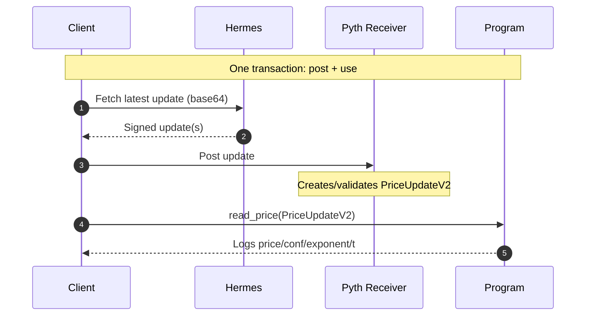

# Solana app for project

This topic explains the 2 parts of the Solana app and the general workflow it will follow.

## Anchor program (onchain)

A Solana smart contract that reads a Pyth price account and enforces guards.
  
Types of checks:

- Account ownership/type check: Ensures passed account is the Pyth Receiver price account (`PriceUpateV2` or a price feed account), owned by the correct program. This prevents users from passing a malicious account.
- Feed identity check: Verify the feed ID matches the asset you expect (e.g., ETH/USD).
- Freshness/staleness guard: Rejects prices older than `MAX_AGE_SECS` via `get_price_no_older_than(...)`. Prevents stale data.
- Confidence interval guard: Ensures `conf` level aka confidence level.
- Basic sanity checks: Require `price != 0`, catch obvious bad inputs
- Overflow-safe math: Keeps match integer-based. Onchain uses fixed integers.
- Atomic/replay posture: uses the update you just posted in the same transaction. Guarantees exactly which price was used.
- Can add app-specific guards.

## Client (offchain)

- Offchain client: a small script/test that builds a transaction and sends it to the Solana cluster. 

  - Connects to a cluster (localnet/devnet) with a wallet.
  - Prepares accounts (Pyth price account or "post + use" with price update account)
  - Builds instructions: Post pyth update / Call Anchor program to `read_price` and pass Pyth account
  - Bundles all of it into a transaction, signs, sends, and awaits confirmation.
  - Reads logs/results and formats output: makes price human-readable.

## Workflow

1. Client (offchain) fetches the signed price update from Pyth's Price Service (Hermes).

2. Client adds two instructions to *one* transaction:
  - A: Call the Pyth Receiver to post the update (writes temporary `price_update` account).
  - B: Call the Anchor program, passing the `price_update` account.
  
3. Client sends the transactions to the Solana cluster, the Solana runtime dispatches each instruction to the target program (programID).

4. Verify onchain: the Anchor program reads the Pyth account and enforces staleness, confidence, and correct feed ID.
  
5. Decision: if a check fails, the instruction errors and the whole txn is rolled back (atomic). You still pay the fee; no partial writes stick.
  
6. Log + return: the program logs raw integers (`price`, `conf`, `expo`, `publish_time`) and returns success/failure.
  
7. Display offchain: the client converts price using expo to a human-readable value and prints it (presentation stays off-chain).

## Transaction flow and explanation

1. Client → Hermes: Client fetches the latest signed update over HTTP.
2. Hermes → Client: Hermes returns the already-signed update blob(s). (Hermes does NOT sign on demand; it distributes updates that were signed off-chain by Pyth publishers.)
3. Client → Pyth Receiver: Client posts the update to the Pyth Receiver (an on-chain program published by Pyth). The Receiver verifies the signatures and materializes a temporary PriceUpdateV2 account on-chain.
4. Client → Your Program: In the same transaction, the client calls your program’s read_price, passing the PriceUpdateV2 account as an input account. Your program reads price/conf/exponent/publish_time from that account and logs them.
5. Program → Logs (seen by Client): When the tx confirms, you see the program’s logs in your terminal.

### Quick defs:

- Hermes: HTTP service that serves the latest signed Pyth price updates (base64).
- Pyth Receiver: Pyth’s on-chain program that verifies those updates and writes them into a PriceUpdateV2 account.
- PriceUpdateV2 account: The transient account your program reads. You can close it after use to reclaim rent.

Rule of thumb: Post + Use in one transaction → guarantees your program reads a fresh, verified update.
